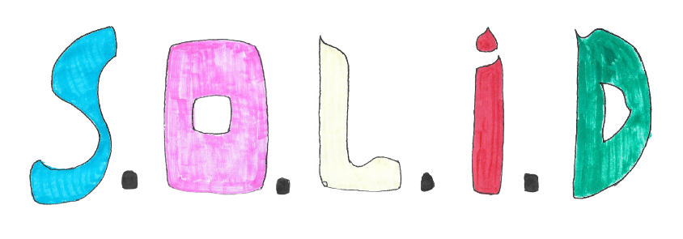

# **SOLID**

  

Esse projeto tem como objetivo apresentar os conceitos do S.O.L.I.D com imagens, descrições, exemplos em Typescript e vídeos que possam auxiliar nos estudos.

- S -> [Single Responsability Principle (SRP)](https://github.com/edualb/solid/tree/main/single_responsability_principle)
- O -> [Open Closed Principle (OCP)](https://github.com/edualb/solid/tree/main/open_closed_principle)
- L -> Liskov Substitution Principle (LSP)
- I -> Interface Agregation Principle (IAP)
- D -> Depency Inversion Principle (DIP)