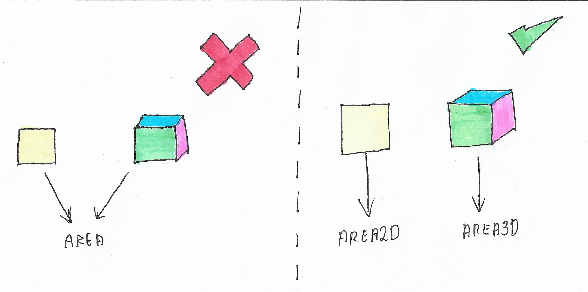
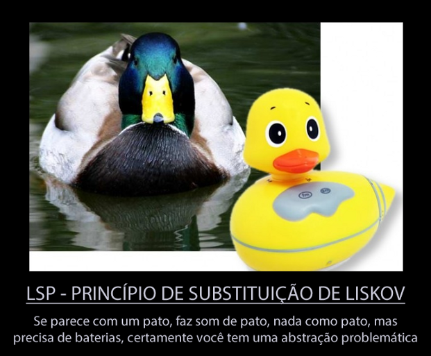

# **Liskov Substitution Principle (LSP)**

  

## **Objetivo**

Esse é o princípio que as pessoas tem mais dificuldades de entender. Por isso, sua explicação será bem direta aqui e na Motivação e nos Exemplos (Como não fazer e Como fazer) terá os melhores detalhes. Em resumo o princípio diz que `Classes derivadas devem ser substituídas por suas classes bases`.

## **Motivação**

O real objetivo desse princípio é de identificar problemas de abstração. Existe alguns memes na internet que mostram bem isso:

  

Dessa forma, a gente consegue granularizar melhor as abstrações se aproximando mais uma vez do [SRP](https://github.com/edualb/solid/tree/main/single_responsability_principle).

## **Como não fazer**

[Clique aqui](https://github.com/edualb/solid/tree/main/liskov-substitution-principle/wrong)

## **Como fazer**

[Clique aqui](https://github.com/edualb/solid/tree/main/liskov-substitution-principle/correct)