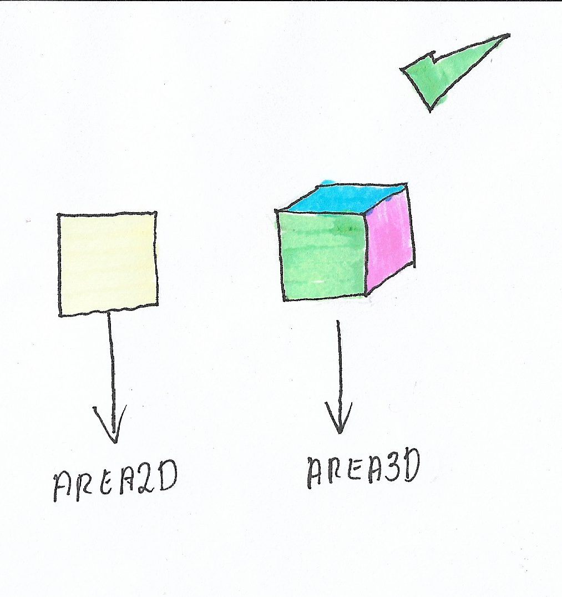

# **Como fazer OCP**

  

## **Explicação**

Para resolver o problema do [exemplo anterior](https://github.com/edualb/solid/tree/main/liskov-substitution-principle/wrong), o desenvolvedor decidiu pensar um pouco melhor na resolução desse problema:

Já que ele não conseguia implementar as duas funções da interface em suas respectivas implementações, ele decidiu quebrar a interface em duas:

- `Area2D`
    - `area(): number`
- `Area3D`
    - `surfaceArea(): number`

Dessa forma, o desenvolvedor terá as suas classes implementando a sua respectiva interface não tendo nenhuma abstração de método não implementado:

- `Square`
    - `area(): number` :heavy_check_mark:

- `Cube`
    - `surfaceArea(): number` :heavy_check_mark:

Contribuindo mais uma vez com o [SRP](https://github.com/edualb/solid/tree/main/single_responsability_principle).
