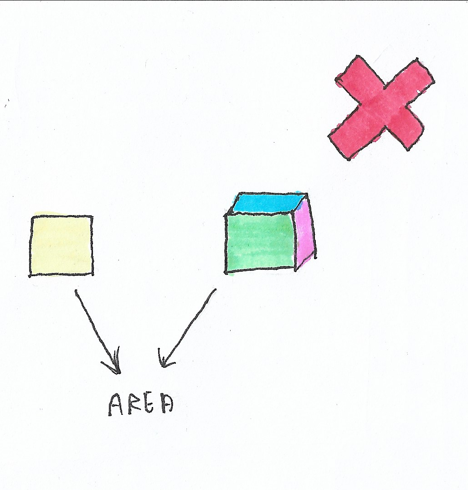

# **Como não fazer OCP**

  

## **Problema**

Imagine que o desenvolvedor tenha inicialmente em seu programa uma interface `Area` onde tem uma função `area2D(): number` e a sua respectiva implementação `Square`. No entanto o PO (Product Owner) chegou com uma demanda que agora a empresa precisa calcular a área superficial de figuras 3D também. Com isso, o desenvolvedor alterou a classe `Area` para atender tanto figuras 2D quanto figuras 3D, dessa forma ficou com o seguinte contrato: `area2D(): number` e `area3D(): number`. Assim sendo, o desenvolvedor criou a classe `Cube` com a implementação da interface `Area`.

O problema nesse caso é que tanto `Square` quanto `Cube` tem pelo menos uma função que não vai estar implementada:

- `Square`
    - `area2D(): number` :heavy_check_mark:
    - `area3D(): number` :x:

- `Cube`
    - `area2D(): number` :x:
    - `area3D(): number` :heavy_check_mark:

Dessa forma o LSP nos ajudou a identificar que nós temos um problema de abstração. Para encontrar a possível solução [Clique aqui](https://github.com/edualb/solid/tree/main/liskov-substitution-principle/correct)

