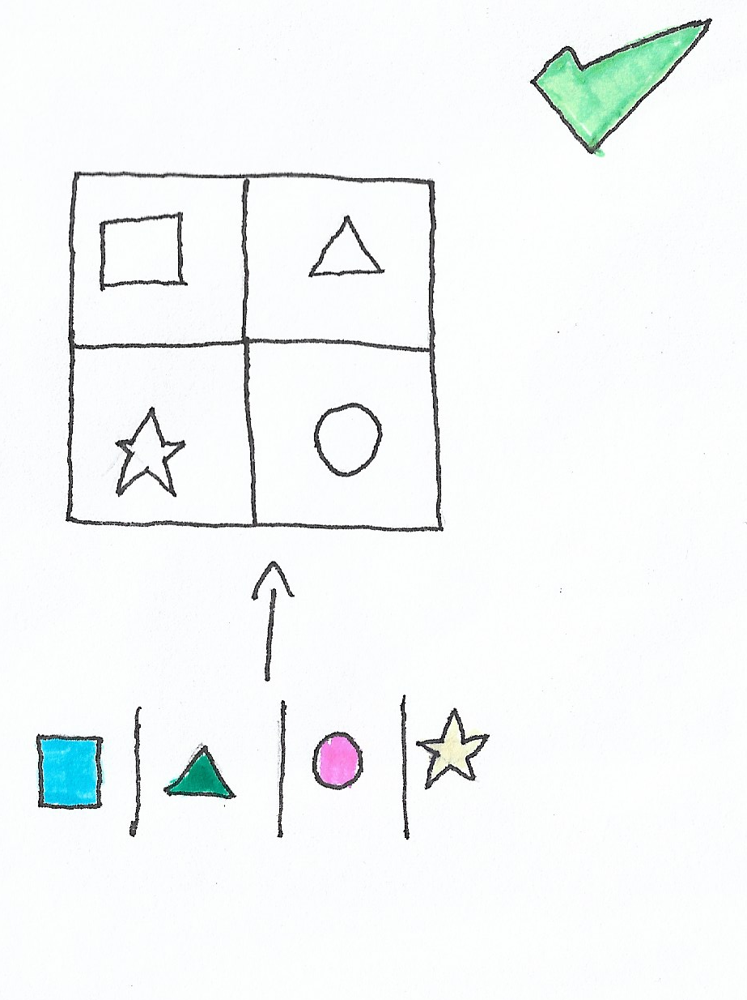

# **Como fazer OCP**

  

## **Explicação**

É possível extrair uma interface que tenha a função abstrata `calculateArea` e ao chamar a classe `AreaCalculator`, inclua essa interface no parâmetro da chamada. Dessa forma, além de diminuir a probabilidade de bug, irá contribuir com o [SRP](https://github.com/edualb/solid/tree/main/single_responsability_principle).