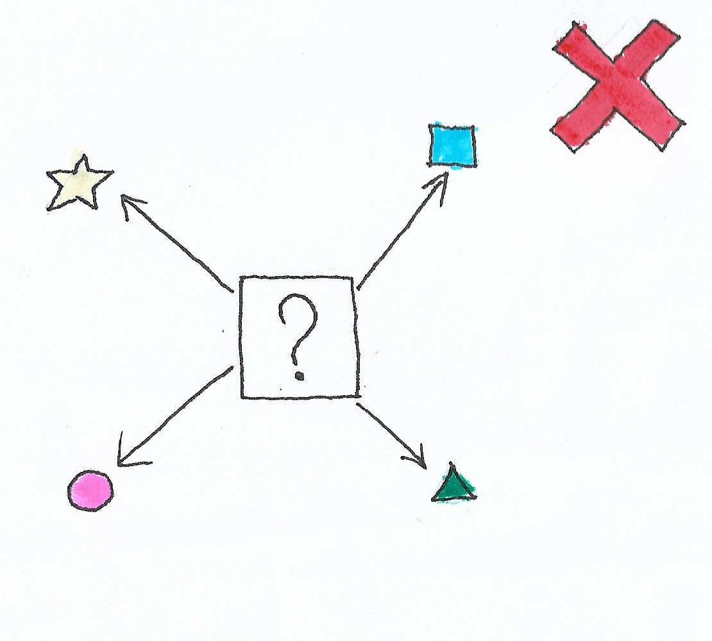

# **Como não fazer OCP**

  

## **Problema**

O código acima mostra uma classe `AreaCalculator` que tem uma função `calculate`. Essa função tem a responsabilidade de calcular a área de uma forma geométrica. Inicialmente, o código só tinha o quadrado mas chegou uma nova feature que precisa incluir a área do circulo também, para isso o desenvolvedor criou um `enum` para incluir os tipos de formas existentes e alterou código fonte para aceitar o circulo.

Note que o desenvolvedor alterou um código já existente, dessa forma, existe o risco de inserir novos bugs na função que ele está alterando. Aqui se encontra uma possível solução para esse problema: [Clique aqui](https://github.com/edualb/solid/tree/main/open_closed_principle/correct)

