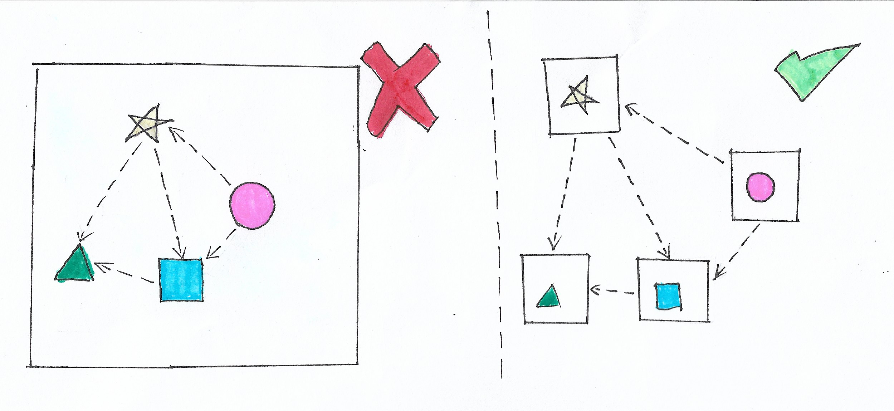

# **Single Responsability Principle (SRP)**

  

## **Objetivo**

Cada classe deve ter uma única responsabilidade.

## **Motivação**

Quando a classe tem somente uma única responsabilidade, os desenvolvedores só irão alterar essa classe quando quiserem modificar essa responsabilidade. Dessa maneira, a manutenibilidade do código fica melhor.

## **Como não fazer**

[Clique aqui](https://github.com/edualb/solid/tree/main/single_responsability_principle/wrong)

## **Como fazer**

[Clique aqui](https://github.com/edualb/solid/tree/main/single_responsability_principle/correct)
