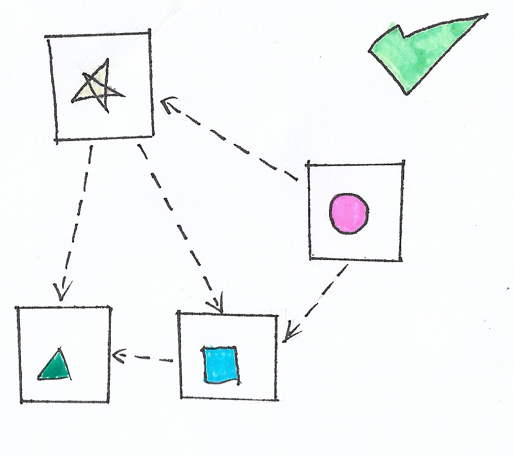

# **Como fazer SRP**

  

## **Explicação**

Caso o desenvolvedor queira alterar somente o código que envolva `Circle`, ele vai ter que mexer na classe `Circle`. Caso o desenvolvedor queira mexer no código que envolva `Star`, ele vai ter que mexer na classe `Star`. Agora, cada classe tem sua responsabilidade, respeitando o SRP.