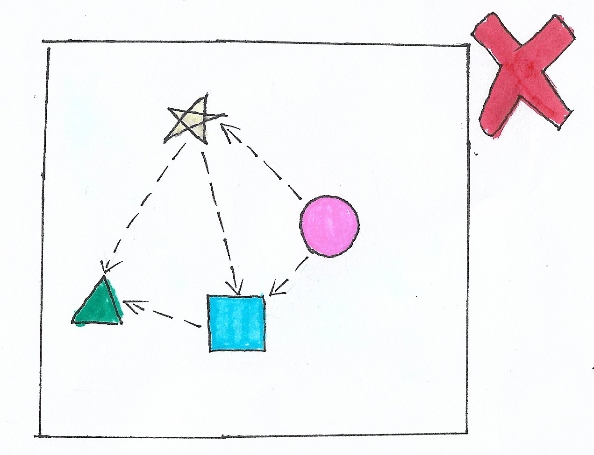

# **Como não fazer SRP**

  

## **Problema**

Caso o desenvolvedor queira alterar somente o código que envolva `Circle`, ele vai ter que mexer na classe `Shapes`. Caso o desenvolvedor queira mexer no código que envolva `Star`, ele vai ter que mexer na classe `Shapes`. Tudo está envolvido nessa classe, ela não tem uma única responsabilidade. Aqui se encontra uma possível solução para esse problema: [Clique aqui](https://github.com/edualb/solid/tree/main/single_responsability_principle/correct)

